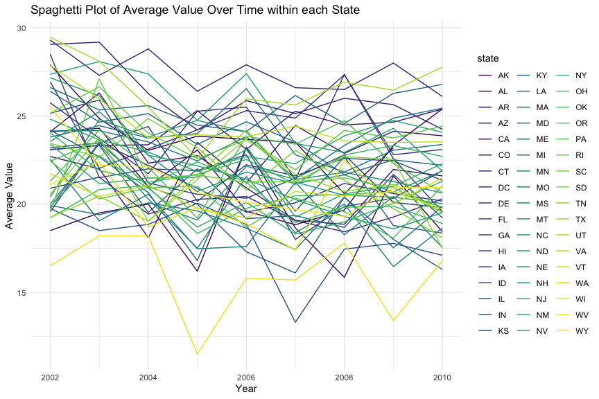

p8105_hw3_yh3676
================
Yuzhe Hu
2023-10-13

``` r
library(tidyverse)
library(ggridges)
library(patchwork)
library(p8105.datasets)

knitr::opts_chunk$set(
    echo = TRUE,
    warning = FALSE,
    fig.width = 9, 
  fig.height = 6,
  out.width = "90%"
)

theme_set(theme_minimal() + theme(legend.position = "bottom"))

options(
  ggplot2.continuous.colour = "viridis",
  ggplot2.continuous.fill = "viridis"
)

scale_colour_discrete = scale_colour_viridis_d
scale_fill_discrete = scale_fill_viridis_d
```

## Problem 1

#### Read in the data

``` r
data("instacart")

instacart = 
  instacart |> 
  as_tibble()
```

#### Answer questions about the data

This dataset contains 1384617 rows and 15 columns, with each row
representing a single product from an instacart order. Variables include
identifiers for user, order, and product; the order in which each
product was added to the cart. There are several order-level variables,
describing the day and time of the order, and number of days since prior
order. Then there are several item-specific variables, describing the
product name (e.g. Yogurt, Avocado), department (e.g. dairy and eggs,
produce), and aisle (e.g. yogurt, fresh fruits), and whether the item
has been ordered by this user in the past. In total, there are 39123
products found in 131209 orders from 131209 distinct users.

Below is a table summarizing the number of items ordered from aisle. In
total, there are 134 aisles, with fresh vegetables and fresh fruits
holding the most items ordered by far.

``` r
instacart |> 
  count(aisle) |> 
  arrange(desc(n))
```

    ## # A tibble: 134 × 2
    ##    aisle                              n
    ##    <chr>                          <int>
    ##  1 fresh vegetables              150609
    ##  2 fresh fruits                  150473
    ##  3 packaged vegetables fruits     78493
    ##  4 yogurt                         55240
    ##  5 packaged cheese                41699
    ##  6 water seltzer sparkling water  36617
    ##  7 milk                           32644
    ##  8 chips pretzels                 31269
    ##  9 soy lactosefree                26240
    ## 10 bread                          23635
    ## # ℹ 124 more rows

Next is a plot that shows the number of items ordered in each aisle.
Here, aisles are ordered by ascending number of items.

``` r
instacart |> 
  count(aisle) |> 
  filter(n > 10000) |> 
  mutate(aisle = fct_reorder(aisle, n)) |> 
  ggplot(aes(x = aisle, y = n)) + 
  geom_point() + 
  labs(title = "Number of items ordered in each aisle") +
  theme(axis.text.x = element_text(angle = 60, hjust = 1))
```


Our next table shows the three most popular items in aisles
`baking ingredients`, `dog food care`, and `packaged vegetables fruits`,
and includes the number of times each item is ordered in your table.

``` r
instacart |> 
  filter(aisle %in% c("baking ingredients", "dog food care", "packaged vegetables fruits")) |>
  group_by(aisle) |> 
  count(product_name) |> 
  mutate(rank = min_rank(desc(n))) |> 
  filter(rank < 4) |> 
  arrange(desc(n)) |>
  knitr::kable()
```

| aisle                      | product_name                                  |    n | rank |
|:---------------------------|:----------------------------------------------|-----:|-----:|
| packaged vegetables fruits | Organic Baby Spinach                          | 9784 |    1 |
| packaged vegetables fruits | Organic Raspberries                           | 5546 |    2 |
| packaged vegetables fruits | Organic Blueberries                           | 4966 |    3 |
| baking ingredients         | Light Brown Sugar                             |  499 |    1 |
| baking ingredients         | Pure Baking Soda                              |  387 |    2 |
| baking ingredients         | Cane Sugar                                    |  336 |    3 |
| dog food care              | Snack Sticks Chicken & Rice Recipe Dog Treats |   30 |    1 |
| dog food care              | Organix Chicken & Brown Rice Recipe           |   28 |    2 |
| dog food care              | Small Dog Biscuits                            |   26 |    3 |

Finally is a table showing the mean hour of the day at which Pink Lady
Apples and Coffee Ice Cream are ordered on each day of the week. This
table has been formatted in an untidy manner for human readers. Pink
Lady Apples are generally purchased slightly earlier in the day than
Coffee Ice Cream, with the exception of day 5.

``` r
instacart |>
  filter(product_name %in% c("Pink Lady Apples", "Coffee Ice Cream")) |>
  group_by(product_name, order_dow) |>
  summarize(mean_hour = mean(order_hour_of_day)) |>
  pivot_wider(
    names_from = order_dow, 
    values_from = mean_hour) |>
  knitr::kable(digits = 2)
```

    ## `summarise()` has grouped output by 'product_name'. You can override using the
    ## `.groups` argument.

| product_name     |     0 |     1 |     2 |     3 |     4 |     5 |     6 |
|:-----------------|------:|------:|------:|------:|------:|------:|------:|
| Coffee Ice Cream | 13.77 | 14.32 | 15.38 | 15.32 | 15.22 | 12.26 | 13.83 |
| Pink Lady Apples | 13.44 | 11.36 | 11.70 | 14.25 | 11.55 | 12.78 | 11.94 |

## Problem 2

#### Read in `brfss_smart2010` data

``` r
library(p8105.datasets)
data("brfss_smart2010")
```

#### Do data cleaning

``` r
brfss_df = 
  brfss_smart2010 |>
  # format the data to use appropriate variable names
  janitor::clean_names() |> 
  rename(state = locationabbr, location = locationdesc) |>
  # focus on the "Overall Health” topic
  filter(topic == "Overall Health") |>
  # include only responses from “Excellent” to “Poor”
  filter(response %in% c("Excellent", "Very good", "Good", "Fair", "Poor" )) |>
  # organize responses as a factor taking levels ordered from “Poor” to “Excellent”
  mutate(response = factor(response, levels = c("Poor", "Fair", "Good", "Very good", "Excellent")))
```

#### Using this dataset, answer the following three questions

In 2002, which states were observed at 7 or more locations? What about
in 2010?

``` r
table_2002 =
  brfss_df |>
  filter(year == 2002) |>
  group_by(state) |> 
  summarise(location_count = n_distinct(location)) |> 
  filter(location_count >= 7)

table_2010 =
  brfss_df |>
  filter(year == 2010) |>
  group_by(state) |> 
  summarise(location_count = n_distinct(location)) |> 
  filter(location_count >= 7)
```

- In 2002, CT, FL, MA, NC, NJ, PA were observed at 7 or more locations.
- In 2010, CA, CO, FL, MA, MD, NC, NE, NJ, NY, OH, PA, SC, TX, WA were
  observed at 7 or more locations.

Construct a dataset that is limited to `Excellent` responses, and
contains, year, state, and a variable that averages the `data_value`
across locations within a state. Make a “spaghetti” plot of this average
value over time within a state.

``` r
# Construct the dataset
excellent_df =
  brfss_df |>
  filter(response == "Excellent") |>
  group_by(year, state) |>
  summarise(data_value_mean = mean(data_value, na.rm = TRUE))

# Make a `spaghetti` plot
excellent_df |>
  ggplot(aes(x = year, y = data_value_mean, group = state, color = state)) +
  geom_line() +
  labs(title = "Spaghetti Plot of Average Value Over Time within each State",
       x = "Year",
       y = "Average Value") +
theme(legend.position = "right")
```



- It can be seen that the average data value varies among the years as
  well as different states.

Make a two-panel plot showing, for the years 2006, and 2010,
distribution of data_value for responses (“Poor” to “Excellent”) among
locations in NY State.

``` r
brfss_df |>
  filter(state == "NY" , year %in% c(2006, 2010)) |>
  ggplot(aes(x = response, y = data_value)) +
  geom_boxplot() +
  labs(title = "Distribution of data_value by Response in NY State",
       x = "response",
       y = "data_value") +
  facet_grid(. ~ year) +
  theme_bw()
```


- It can be seen that there is a significant increase in the
  `data_value` for `Very Good` response in NY State from 2006 to 2010.

## Problem 3

#### Load, tidy, merge, and otherwise organize the data sets

Final dataset should include all originally observed variables; exclude
participants less than 21 years of age, and those with missing
demographic data; and encode data with reasonable variable classes
(i.e. not numeric, and using factors with the ordering of tables and
plots in mind).

``` r
covar_df = 
  read_csv('data/nhanes_covar.csv', skip = 4) |>
  janitor::clean_names() |>
  filter(age >= 21) |>
  drop_na() |>
  mutate(
    sex = case_match(
      sex,
      1 ~ 'male',
      2 ~ 'female')) |>
  mutate(
    education = case_match(
      education,
      1 ~ 'Less than high school',
      2 ~ 'High school equivalent',
      3 ~ 'More than high school')) |>
  mutate(education = factor(education, levels = c('Less than high school', 'High school equivalent', 'More than high school'), ordered = TRUE))

accel_df =
  read_csv('data/nhanes_accel.csv') |>
  janitor::clean_names() 

joined_df = 
  left_join(covar_df, accel_df, by = 'seqn') 
```

#### Produce a reader-friendly table for the number of men and women in each education category

``` r
joined_df |> 
  group_by(sex,education) |> 
  summarise(number = n()) |> 
  pivot_wider(
    names_from = education, 
    values_from = number
  ) |>
  knitr::kable()
```

| sex    | Less than high school | High school equivalent | More than high school |
|:-------|----------------------:|-----------------------:|----------------------:|
| female |                    28 |                     23 |                    59 |
| male   |                    27 |                     35 |                    56 |

- From the table, it can be seen that the participants’ sex-ratio are
  mostly balanced in `Less than high school` category and
  `More than high school` category. In `High school equivalent`category,
  there are more male participants than female (35:23). The
  `More than high school education` category contains more participants
  compared to the other two categories.

#### Create a visualization of the age distributions for men and women in each education category

``` r
joined_df |>
  ggplot(aes(x = education, y = age, fill = sex)) +
  geom_boxplot() +
  labs(title = "Age Distribution by Education and Gender", x = "Education", y = "Age")
```


- From the boxplot, it can be seen that participants with
  `More than high school` education is significantly younger than the
  other two education categories. In `High school equivalent` category,
  male participants are younger than female participants, while in the
  other two categories the age distributions are similar between sexes.

#### Plot total activities against age with separate panels for each education level

``` r
joined_df |>
  mutate(total_act = rowSums(across(min1:min1440))) |>
  ggplot(aes(x = age, y = total_act, color = sex)) +
  geom_point(alpha = 0.5) +
  geom_smooth(se = FALSE) +
  facet_grid(. ~ education) +
  labs(title = "Total Activities Against Age", x = "Age", y = "Total Activity")
```


- From the above graph, generally, total activity within a day goes down
  when age increases. In `High school equivalent` and
  `More than high school` education categories, female participants tend
  to have more total daily activity than male, while in
  `Less than high school` category male have more total daily activity
  than female when they come older.
